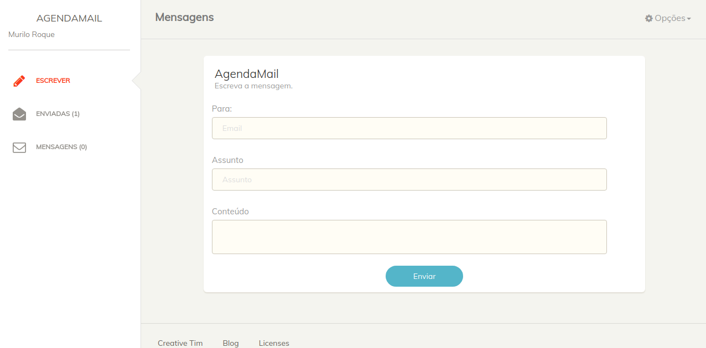

 

# Backend Challenge (Agenda Edu)

Primeiramente, você pode encontrar os requerimentos deste projeto [aqui](https://github.com/agendakids/desafio-backend)

Neste projeto eu:

- Criei endpoints de uma API para uma aplicação já existente de envio de mensagens;
- Tive uma boa cobertura de código;
- Organizei a estrutura do projeto utilizando padrões de projetos;
- Evitei N + 1 nas queries;
- Hospedei a aplicação no Heroku.

# O que faz?

- Quando o aplicativo é executado você pode:

  - Fazer login, logout ou registrar um novo usuário;
  - Visualizar mensagens recebidas e enviadas;
  - Escrever uma nova mensagem para outro usuário;
  - Visualizar seu perfil;
  - Visualizar a sua chave API para utilizar o API, explicado a seguir.

# Utilizando o API

- A aplicação possui um usuário master, com os seguintes dados:

  - E-mail: master@email.com

  - Password: 123456

- Cada usuário possui um token (que é constante para o master) que é enviado pelo header na solicitação: `Authorization=[string]`

  ## Mensagens

  `GET` | `/messages`

  Exemplo: `curl 'backend-challenge-murilo.herokuapp.com/api/v1/messages' -H 'Authorization: Token token=ADMI123456'`

  ## Criar mensagens

  `POST` | `/messages` | `message[receiver_email]=matheus@email.com&message[title]=string&message[content]=string`

  Exemplo: `curl -X POST 'backend-challenge-murilo.herokuapp.com/api/v1/messages' -H 'Authorization: Token token=ADMI123456' -d 'message[receiver_email]=master@email.com&message[title]=APITEST&message[content]=CONTEUDO'`

  ## Mensagens Enviadas

  `GET` | `/messages/sent`

  Exemplo: `curl -X GET 'backend-challenge-murilo.herokuapp.com/api/v1/messages/sent' -H 'Authorization: Token token=ADMI123456'`

  ## Mostrar mensagem

  `GET` | `/messages/:id`

  Exemplo: `curl -X GET 'backend-challenge-murilo.herokuapp.com/api/v1/messages/1' -H 'Authorization: Token token=ADMI123456'`

  ## Mostrar perfil

  `GET` | `/profile`

  Exemplo: `curl -X GET 'backend-challenge-murilo.herokuapp.com/api/v1/profile' -H 'Authorization: Token token=ADMI123456'`

  ## Atualizar perfil

  `PATCH` | `/profile`

  Exemplo: `curl -X PATCH 'backend-challenge-murilo.herokuapp.com/api/v1/profile?user[name]=HelloWorld' -H 'Authorization: Token token=MURI174204'`

## Construído com

- Ruby on Rails
- RSpec

## App Online

[Clique para ver no Heroku](https://backend-challenge-murilo.herokuapp.com/)

## Setup

- Clone o projeto para sua máquina local;
- `cd` no diretório do projeto;
- Rode `bundle install` para instalar as gems necessárias;
- Rode `rails db:create`;
- Rode `rails db:migrate`;
- Rode `rails s` para iniciar o servidor no seu computador;
- No endereço do seu navegador, digite o seguinte: [localhost:3000](localhost:3000);
- Rode `bundle exec rspec` para ver o resultado dos testes;
- Aproveite o aplicativo e suas funcionalidades!

## Autor

Murilo Roque Paiva da Silva

Github: [@MuriloRoque](https://github.com/MuriloRoque)

Twitter: [@MuriloRoquePai1](https://twitter.com/MuriloRoquePai1)

Linkedin: [MuriloRoque](https://www.linkedin.com/in/murilo-roque-b1268741/)

## 🤝 Contribuindo

Contribuições, problemas e pedidos são bem vindos! Comece por:

- Forke o projeto;
- Clone o projeto para sua máquina local;
- `cd` no diretório do projeto;
- Rode `git checkout -b your-branch-name`
- Faça suas contribuições;
- Push sua branch para o repo forkado;
- Abra uma Pull Request com a descrição detalhada para a branch de desenvolvimento do projeto original para uma revisão.

## Mostre seu suporte

Me dê uma ⭐️ se você gostou deste projeto!